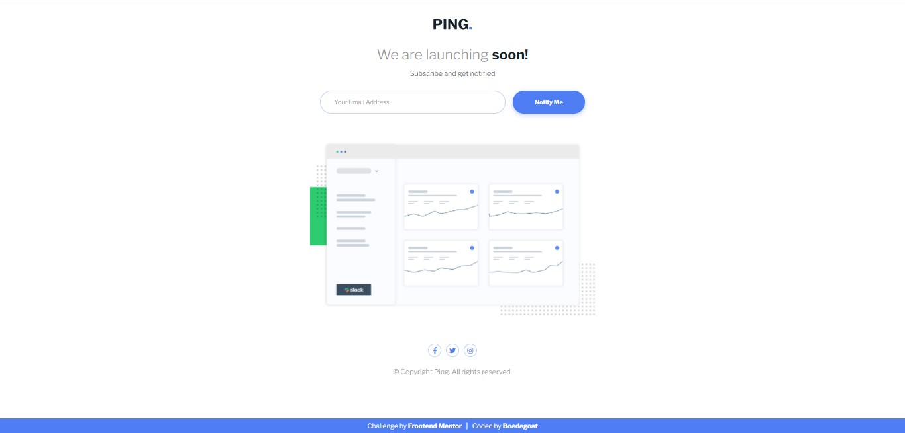

# Frontend Mentor - Ping coming soon page solution

This is a solution to the [Ping coming soon page challenge on Frontend Mentor](https://www.frontendmentor.io/challenges/ping-single-column-coming-soon-page-5cadd051fec04111f7b848da). Frontend Mentor challenges help you improve your coding skills by building realistic projects.

## Table of contents

- [Overview](#overview)
  - [The challenge](#the-challenge)
  - [Screenshot](#screenshot)
  - [Links](#links)
- [My process](#my-process)
  - [Built with](#built-with)
  - [What I learned](#what-i-learned)
  - [Useful resources](#useful-resources)
- [Author](#author)
- [Acknowledgments](#acknowledgments)

## Overview

### The challenge

Users should be able to:

- View the optimal layout for the site depending on their device's screen size
- See hover states for all interactive elements on the page
- Submit their email address using an `input` field
- Receive an error message when the `form` is submitted if:
  - The `input` field is empty. The message for this error should say _"Whoops! It looks like you forgot to add your email"_
  - The email address is not formatted correctly (i.e. a correct email address should have this structure: `name@host.tld`). The message for this error should say _"Please provide a valid email address"_

### Screenshot




### Links

- [solution URL](https://www.frontendmentor.io/solutions/css-flexbox-css-animation-vanilla-javascript-XVHruqxTY)
- [live site URL](https://boedegoat-ping-coming-soon-page.vercel.app/)

## My process

### Built with

- Semantic HTML5 markup
- CSS custom properties
- CSS Flexbox
- Vanilla JavaScript

### What I learned

1. Create google material design input style

   so bassically, we use the label element as the input placeholder

   ```html
   <div class="form-control">
     <input type="text" id="name" placeholder=" " />
     <label for="name">Name</label>
   </div>
   ```

   As you can notice, I put empty placeholder for css styling purpose

   So, Lets get in to css styling

   First, Set the input wrapper position to relative

   ```css
   .form-control {
     position: relative;
     /* for instance : */
     width: 200px;
   }
   ```

   Style the input

   ```css
   .form-control input {
     padding: 15px 20px;
     outline: none;
     border-radius: 5px;
     border: 1px solid #fff;

     /* make the input full size to its wrapper */
     width: 100%;
     height: 100%;
   }
   ```

   Then, set the label position to absolute

   ```css
   .form-control label {
     position: absolute;

     /* for centering y axis */
     top: 50%;
     transform: translateY(-50%);

     /* align label perfectly to the start of the input text  */
     padding: 0 5px;
     left: 10px;

     transition: 0.3s;
   }
   ```

   Use `:focus` pseudo class so when the input is on focus, move the label to the top

   ```css
   .form-control input:focus + label {
     top: 0;

     /* match the background */
     background: #fff;
   }
   ```

   Lastly, add `:not` to handle if input is not focus and the placeholder not shown (which means the input has been filled) to make the label keep stay at the top

   ```css
   .form-control input:focus + label,
   .form-control input:not(:focus, :placeholder-shown) + label {
     top: 0;

     /* match the background */
     background: #fff;
   }
   ```

   And yeah, now your input looks pretty good !

2. Style input error message and validation
3. Make loading spinner animation

### Useful resources

- [Florin Pop - JavaScript Client-side Form Validation](https://www.youtube.com/watch?v=rsd4FNGTRBw&t=1472s) - This video helped me to make input error message style and validation

- [Bedimcode - Input Animation With HTML & CSS | Style Google](https://youtu.be/UCMNYTid070) - This one helped me to make google input style

## Author

- Frontend Mentor - [@boedegoat](https://www.frontendmentor.io/profile/boedegoat)
- Email - bhremada.fka@gmail.com

## Acknowledgments

- **Code grepper (adriendums) -** for email regex function
- **W3School -** for submit button loading guide
- **Stackoverflow -** for ignoring chrome autofill color css snippets
